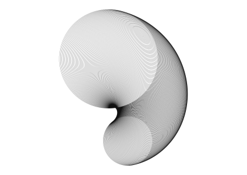

# piplot

Drive a pen plotter from a Raspberry Pi, and design the drawings in a browser.

**[Try the curve studio](https://sui001.github.io/piplot/)**. It runs entirely
in the browser, no plotter needed. Design something, download the SVG.

A Flask app serves a page where you build curves with live preview, then posts
the finished path back to be plotted. The browser does all the maths and sends
points in paper millimetres, so what you previewed is literally what gets
drawn: nothing re-derives the path at the other end.



## What is here

| File | Does |
|---|---|
| `server.py` | The web app. Serves the page, validates paths, runs the plot. |
| `docs/index.html` | The page. Curve generators, preview, the same file GitHub Pages serves. |
| `plotter.py` | Pen backends. `DryRun` writes SVG, `AxiDraw` drives the EBB over USB. |
| `pen_box.py` | Draws an inset rectangle. Run this first on a new machine. |

## Running it

```bash
sudo apt install -y python3-numpy python3-serial python3-venv python3-flask
python3 -m venv --system-site-packages ~/venv
~/venv/bin/pip install https://cdn.evilmadscientist.com/dl/ad/public/AxiDraw_API.zip
~/venv/bin/python server.py
```

Raspberry Pi OS Trixie enforces PEP 668, so a plain `pip install` into the
system refuses to run. Do not reach for `--break-system-packages`. numpy,
pyserial and flask come from apt, and the venv is built with
`--system-site-packages` so it can see them while pip handles the AxiDraw
driver, which Debian does not package.

By default the server binds the machine's Tailscale address rather than
`0.0.0.0`, because a plotter control panel on an open network is a plotter
anyone can drive. Pass `--host 0.0.0.0` if you want that anyway.

Before drawing anything on a machine for the first time:

```bash
python pen_box.py --model 2 --paper 420x297 --inset 20 --dry
```

`--dry` checks and prints the path without moving. Drop it to draw.

## The generators

Four ways to make a curve. All of them produce **one continuous path**, which
is what a plotter wants.

**epicycle**: a sum of rotating vectors per axis. Spirograph, harmonograph
and ellipse are all special cases, so one engine covers the family.

**circles**: draw a circle, step the rotation, shrink it, repeat. A circle
turned about its own centre is unchanged, so the rotation only bites once the
circle is offset; and the envelope of a family of circles whose centres run
round a circle is a limaçon. The same curves as the epicycle mode, reached as
a mechanism instead of a formula.

**pid**: a controller chasing a setpoint that orbits the plane. The pen is
the plant, a unit point mass, not the setpoint, so what gets drawn is the
controller's pursuit of a target it never catches. Saturation and loop delay
are exposed because windup and dead time are where the good asymmetry comes
from.

**lqr**: optimal state feedback. For a double integrator the Riccati equation
solves in closed form, so there is no solver here, just:

```
K₁ = √(q₁/r)        K₂ = √(2√(q₁/r) + q₂/r)
```

which surfaces something the UI says out loud: with `q₂ = 0` the damping ratio
is pinned at `1/√2` whatever `q₁` and `r` do, so sweeping `R` slides the poles
along a 45° ray and only the frequency moves. `q₂` is what lets damping vary.
Sweeping `R` draws the root locus as a family of trajectories.

### The sweep is the point

What gives these drawings their tone is not shading, it is **line spacing**.
One parameter drifts a little on every pass, consecutive passes bunch up
against an envelope, and those caustics are the dark edges. Rotating and
scaling a fixed curve only gives you concentric rings.

Two controls matter more than they look:

- **sweep amount**: small values, 0.02 to 0.5, are where the good structure
  is. Large values just smear.
- **passes**: counterintuitively, *fewer* passes over a *wider* sweep beats
  more passes over a narrow one. Too many and the family closes into a solid
  black band.

## Claims, not status messages

A pen plotter has no home switches and no soft limits. Send it a point past
the end of the rail and it will drive there, grind, lose steps, and report
nothing. Every status line will say the job went fine.

So both the server and `pen_box.py` state what makes a path plottable and
**refuse** rather than warn: finite numbers, and every point inside the
machine's travel envelope, checked before the motors are enabled. An A3 box on
an A4 machine needs 400 x 277 mm against 300 x 218 mm, and that failure is
silent unless something asserts it.

Plotting runs on a worker thread with a stop flag checked between every
segment, because the thing you want most from a bad half-hour plot is for it
to stop now.

## Credit

The `strand` presets are **after Kerry Strand's *The Snail* (1968)**, which won
first prize in the *Computers and Automation* art contest and was made on a
CalComp pen plotter.

They are a study, not a reconstruction. Strand's own equations are not
something I have, and the presets were arrived at from the structure of the
image rather than from his program. If you use them, credit the original.

## Licence

MIT. See [LICENSE](LICENSE).
